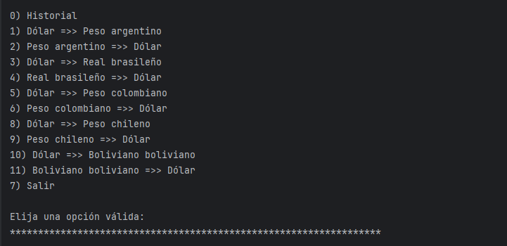

<h1 align="center"> Conversor de monedas </h1>

<div style="text-align: center;">
  
</div>


<div align="right">
  
</div>


## 💡 **Sobre el Desafío** 💡
Este proyecto permite realizar conversiones de monedas enfocándose en una selección de 10 tipos de cambios diferentes. El sistema genera un historial detallado en tiempo real, registrando cada operación a medida que el usuario utiliza el programa.
Es importante señalar que la aplicación consume datos de una API pública https://www.exchangerate-api.com/ . Los valores de las conversiones dependen de las actualizaciones constantes de dicha API, por lo que los resultados reflejan la información proporcionada por el servicio externo en el momento de la consulta.

## 🔑 **Configuración Inicial**
Para que el programa funcione correctamente, es necesario configurar tu propia llave de acceso (API Key):

1. Regístrate de forma gratuita en [ExchangeRate-API](https://www.exchangerate-api.com/) para obtener tu llave.
2. En el archivo `Api.java`, busca la variable `clave` y reemplaza el texto `"tu-api-key"` por tu llave real:
   ```java
   String clave = "TU_API_KEY_AQUÍ";

## 🔨 **Funcionalidades del Proyecto:**

1. ***&nbsp; Interacción por Consola:*** Interfaz de usuario basada en menús dentro de un bucle de repetición, utilizando la clase `Scanner` para capturar opciones y montos.
2. ***&nbsp; Consumo de API:*** Solicitudes HTTP estructuradas mediante `HttpClient` y `HttpRequest` para obtener tasas de cambio en tiempo real desde **ExchangeRate-API**.
3. ***&nbsp; Procesamiento JSON con Gson:*** Conversión eficiente de las respuestas de la API a objetos Java mediante la biblioteca **Gson**, facilitando el acceso a la propiedad `conversion_result`.
4. ***&nbsp; Soporte de Monedas:*** Filtrado y conversión de monedas específicas como **ARS, BRL, COP, CLP** y **USD** utilizando los códigos oficiales de la API.
5. ***&nbsp; Historial de Sesión:*** El sistema rastrea cada operación en una lista dinámica, permitiendo al usuario consultar sus actividades **durante la ejecución actual del programa**.
6. ***&nbsp; Marca de Tiempo:*** Uso de la biblioteca `java.time` para generar registros precisos que incluyen fecha y hora de cada conversión realizada.

## 🛠️ Tecnologías Utilizadas
* **Java JDK:** Versión 21.
* **Biblioteca Gson:** Versión gson-2.13.2 para la manipulación de JSON.
* **ExchangeRate-API:** Servicio externo para obtener tasas de cambio actualizadas https://www.exchangerate-api.com/ .
* **IntelliJ IDEA:** Entorno de desarrollo utilizado.
 

##### ***Estado de las funcionalidades:***
---
*[x] Configuración de cliente HTTP: Implementación de HttpClient para conexión con el servidor.

*[x] Consumo de API: Solicitudes exitosas a ExchangeRate-API para obtener tasas en tiempo real.

*[x] Mapeo de datos JSON: Serialización y deserialización de datos utilizando la biblioteca Gson.

*[x] Menú interactivo: Bucle de consola con múltiples opciones de conversión y salida controlada.

*[x] Filtro de monedas: Soporte específico para monedas seleccionadas (USD, ARS, BRL, COP, CLP).

*[x] Cálculo de conversión: Lógica matemática para aplicar la tasa de cambio al monto ingresado.

*[x] Historial de sesión: Registro dinámico de las consultas realizadas durante la ejecución.

*[x] Marca de tiempo: Inclusión de fecha y hora exacta en cada registro mediante java.time.

<h3 style="color: Green; font-style: italic;">Autor</h3>

<a href="https://github.com/LucasKronos10" title="Perfil">
  
</a>

| ***Lucas Pavez*** |
|-------------------|

<span style="color: red; font-weight: bold; font-style: italic; font-size: 1.17em; line-height: 1.3;">
  Tipo de licencia:
</span>


---
[***Licencia***](LICENSE)


